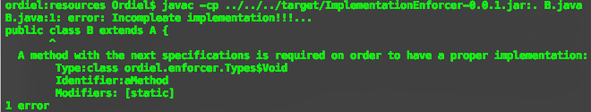

#Implementation Enforcer
Provides a way to define how does the inheritance (of a class) and/or the implementation of an instance should take place for elements whose enforcement CANNOT be enforced by standard Java code. For example:

* static elements
* Class attributes
* Behavioural aspects as:
	* Transient
	* Volatile
	* final  

##Usage example
Lets suppose that an API developer desires all the subclasses of the class A to have a method called `aMethod` which should be `static` with no parameters and should return `void`. There is no way he can achieve that by simply using java native functionality, but using this libraries he would be able to do this: 

**Class A:**

```
#!java
import javax.lang.model.element.Modifier;
import ordiel.enforcer.MethodRequester;
import ordiel.enforcer.Types.Void;

@MethodRequester(
	identifier = "aMethod", 
	type = Void.class, 
	parametersTypes={}, 
	parametersIdentifiers = {}, 	
	requestedModifiers={Modifier.STATIC})
public abstract class A {}
```
	
Then a developer using the provided API would try to create its own implementation of class `A` by inheriting from it and would try to do something like:

**Class B:**

```
#!java
public class B extends A {}
```
    
When trying to compile class `B` the developer is going to receive the next error message: 



In deed if you want to play the role of the API dev and the user of such API (as I did to create this example) you can put those two files in the same folder and then call the command:

	javac -cp /path/to/ImplementationEnforcer-0.0.1.jar:. B.java
	
By doing so you should get that exact same output. In deed such example can be found in the `src/test/resources` folder of the project (those smart cookies maybe determined that from my console output).

For those who are not quite familiar with the usage of the *cli* for compiling java code I will do a little walk through to explain that command. 

* *First* `javac` is the command to request java that you want to compile a `.java` file. 
* *Second* `-cp` is the flag that specifies that you are going to provide/add elements to the *class path*. 
* *Then* `/path/to/ImplementationEnforcer-0.0.1.jar:.` this is the provided *class path*, as you can notice it contains the path to the *jar* containing the **implementation enforcer** and then separated by a collon is a `.`, this indicates the current directory so that it can find `A`; remember that I mention before *"those two files in the same folder"*. 
* *Last* `B.java` I am just telling it wich file do I want to compile, which in this case is the one containing the class `B`.

##TODO
* If the class/interface where the Method/Type is requested is not abstract throw a warning in the annotation processor to indicate that this use case is not required and may be it may stop being supported in further versions.
* Check if it is possible to define them in annotations.
* Maybe it is possible to remove the Types since apparetly java can distinguish from `Integer` and `int` when calling `int.class` and `Integer.class`.

##Version History
### 0.0.1
Functional for both methods and attributes.

--- 
#Author
**César Alonso Martínez Sánchez**

<ordiel1910@gmail.com>

[](https://www.facebook.com/ordiel) [](https://www.linkedin.com/pub/césar-alonso-martínez-sánchez/66/734/8b8) [](https://plus.google.com/u/0/+C%C3%A9sarAlonsoMart%C3%ADnezS%C3%A1nchez) [](https://twitter.com/Ordiel1)